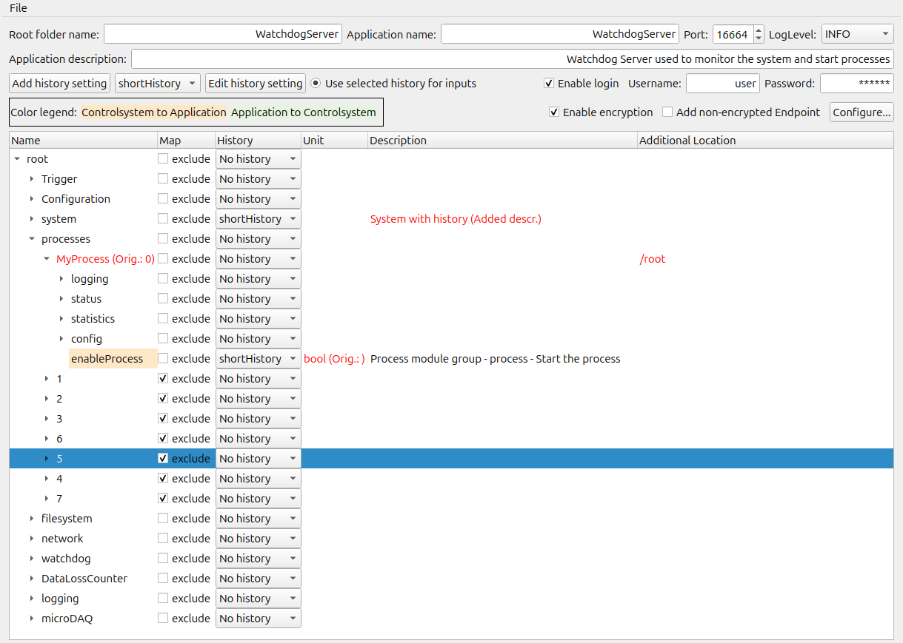

# ControlSystem-OPCUA_Adapter

![Supported Platforms][api-platforms]

[api-platforms]: https://img.shields.io/badge/platforms-linux%20-blue.svg "Supported Platforms"

Welcome to the ControlSystem-OPCUA_Adapter project. 
This project add an control system adapter to [ChimeraTK](https://github.com/ChimeraTK), that is based on the OPC UA stack [open62541](https://open62541.org/).

# Mapping 

In order to use the control system adapter a dedicated map file is required. The name of the map file is expected to be _ApplicationName_\_mapping.xml, where _ApplicationName_ is the name of the ChiemraTK application.

The map file allows to change general OPC UA settings and to control/configure the process of mapping ChimarTK process variables to OPC UA nodes.
In principle all process variables are mapped in the OPC UA server. Node IDs and browse names are derived from the process variables register paths.
The mapping allows to extend the variable tree based on the tree created from mapping the ChimeraTK process variables.
Details can be found in the documentation of the [xml scheme file](xmlschema/opcua_mapfile.xsd). An [example map file](examples/example_mapping.xml), illustrated how to set general properties of the OPC UA server.

## Map file generator

It is recommended to use the [mapfile generator](tools/mapfileGenerator/chimeratk-opc-ua-mapfile-generator) included in this project to generate map files or to modify existing map files. 
The generator can be started without any input files. It allows to create map file that includes the general server configuration parameters:
* Port
* Application root directory, name, description
* Enable encrytion
     * Requires server certificate and private key
     * Optinal supply CA certificate, revocation list, trusted certiciates
* Add login
     * username
     * password
* Set logging level (can be changes also at runtime)
   
Each ChimeraTK application should include an XML generator that allows to create an XML file that includes the address space of the application. 
If using the map file generator with such an application specific XML fie the generaotr allows to:
* Rename process variables or folders (double click on the name to edit)
* Restructure the address space
     * Move individual process variables to a different location (drag and drop)
     * Move complete folder to a different location (drag and drop)
* Exclude process variables or folders from the mapping process
     * Excluded process variables will not be part of the OPC UA address space
     * The application is optimized considering unmapped process variables
* Change process variable unit and description
* Assign a history to process variables or folders (add history setting first and use folder/process variable drop down after)
     * Multiple history settings can be created
     * A history can be assigned to all application input variables with one single switch

Below is a screenshot of the map file generator illustrating the features discussed above.

 
   

# OPC UA stack

In principle it is possible to install open62541 via official packages, but it is recommended to install the [open62541 interface](https://github.com/ChimeraTK/open62541-interface) included in ChiemraTK. It might include patches in the future and freezes the open62541 version. Thus, it is guaranteed that the control system adapter works - independent of upstream changes of the open62541 stack.

# Author Contributions  

A [list of autors](AUTHORS.md) is contained in this directory.
