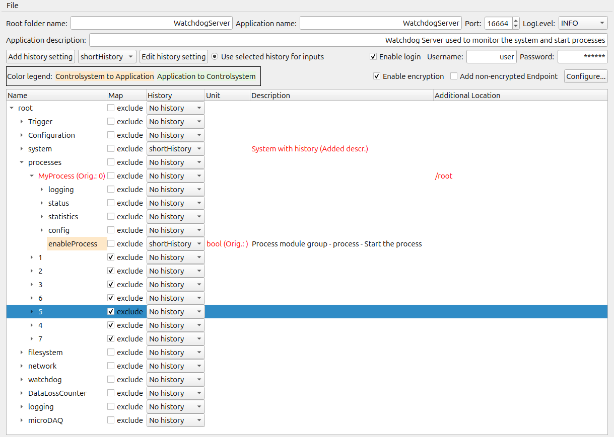

# ControlSystem-OPCUA_Adapter

[](https://www.gnu.org/licenses/lgpl-3.0.html)
[](https://doi.org/10.14278/rodare.3256)
![Supported Platforms][api-platforms]

[api-platforms]: https://img.shields.io/badge/platforms-linux%20-blue.svg "Supported Platforms"

Welcome to the ControlSystem-OPCUA_Adapter project. 
This project add an control system adapter to [ChimeraTK](https://github.com/ChimeraTK), that is based on the OPC UA stack [open62541](https://open62541.org/).

## Void handling

The control system adapter supports all Void types used in ChimeraTK.

`ChimeraTK::VoidOutput`:
* Outputs are implemented as OPC UA events
* The events are registered with the `Server` node (`Root/Objects/Server`)
* They are of type `VoidEventType` and include addition information like validity or control system path of the triggering `ChimeraTK::VoidOutput`

`ChimeraTK::VoidInput`:
* It can be decided in the mapping if an `UA_Boolean` or an OPC UA method based implementation is used for Void inputs 
* `UA_Boolean` based implementation is meant to be used in case clients do not support OPC UA method calls
* `UA_Boolean` implementation:
  * Value will always be `UA_FALSE`
  * To trigger writing the `ChimeraTK::VoidInput` write `UA_TRUE` to the PV
  * After writing `UA_TRUE` the value of the PV is still `UA_FALSE`
* OPC UA method
  * Call the corresponding method to trigger writing the `ChimeraTK::VoidInput`

# Supported history backends

Two history backend types are supported:
* Circular buffer backend (provided by open62541)
* InfluxDB backend

## Circular backend

* Stores data in memory
* Fixed buffer length
* Different buffer lengths are possible by defining different history setups in the mapping

## InfluxDB backend

* Backend is based on InfluxDB v2
* Data is directly send to InfluxDB
* In case of arrays an index tag is added to distinguish different array elements
* If history data is requested by a client the data is retrieved from InfluxDB and provided via the OPC UA interface
* If history data of an array is requested the data of all array elements will be returned 
  * Currently there is no way for the client to specify a certain index
  * If individual data is needed the client is supposed to get it directly from the database using the index tag
* Configuration of the InfluxDB needs to be provided by `influx_config.xml`
* Example configuration:
```
<?xml version="1.0" encoding="UTF-8"?>
<csa:influxdb xmlns:xsi="http://www.w3.org/2001/XMLSchema-instance"
  xmlns:csa="https://github.com/ChimeraTK/ControlSystemAdapter-OPC-UA-Adapter"
  xsi:schemaLocation="https://github.com/ChimeraTK/ControlSystemAdapter-OPC-UA-Adapter influx_config.xsd">
  <csa:url>https://influx.de</csa:url>
  <csa:token>TOKEN</csa:token>
  <csa:org>Organization</csa:org>
  <csa:bucket>testing</csa:bucket>
  <csa:measurement>demo_measurement</csa:measurement>
  <csa:precision>ns</csa:precision>
  <csa:extra_tags>
    <csa:tag name="extra_tag">mytag</csa:tag>
  </csa:extra_tags>
  <csa:write_batching>
    <csa:enabled>true</csa:enabled>
    <csa:max_batch_points>250</csa:max_batch_points>
    <csa:max_queue_points>10000</csa:max_queue_points>
    <csa:flush_interval_ms>5000</csa:flush_interval_ms>
    <csa:max_retries>3</csa:max_retries>
    <csa:retry_backoff_ms>200</csa:retry_backoff_ms>
    <csa:fail_fast_on_async_error>false</csa:fail_fast_on_async_error>
  </csa:write_batching>
</csa:influxdb>
```
### Write Batching (Current Implementation)

The Influx client supports asynchronous write batching to reduce HTTP overhead. 
Use OPC UA health nodes (`ns=1;s=InfluxHealth.*`) to monitor queue growth, retries, failures, and last async error.

#### Configuration

Batching is configured in `config/influx_config.xml` inside `write_batching` (see above).

Meaning of settings:

- `enabled`: turns async batching on or off.
- `max_batch_points`: maximum number of points sent in one HTTP write request.
- `max_queue_points`: maximum buffered points waiting to be sent.
- `flush_interval_ms`: maximum time to wait before flushing a partial batch.
- `max_retries`: retry attempts after a failed batch write.
- `retry_backoff_ms`: base retry wait time. Retries use exponential backoff.
- `fail_fast_on_async_error`: when `true`, new writes are rejected while an async error is active.


#### Runtime Behavior

- If batching is disabled, `writePoint` performs a direct HTTP write.
- If batching is enabled, `writePoint` enqueues points and returns immediately.
- A background worker flushes points when:
    - queued points reach `max_batch_points`, or
    - `flush_interval_ms` expires.

#### Failure Handling

- Failed batch writes are retried with exponential backoff.
- If retries still fail:
    - the batch is requeued at the front when queue capacity allows,
    - otherwise points are dropped and accounted in health counters.
- If `fail_fast_on_async_error` is enabled, new writes fail until the async error is cleared.

#### Notes

- In async mode, successful enqueue does not guarantee the batch has already been written to InfluxDB.

# Mapping 

In order to use the control system adapter a dedicated map file is required. The name of the map file is expected to be _ApplicationName_\_mapping.xml, where _ApplicationName_ is the name of the ChiemraTK application.

The map file allows to change general OPC UA settings and to control/configure the process of mapping ChimarTK process variables to OPC UA nodes.
In principle all process variables are mapped in the OPC UA server. Node IDs and browse names are derived from the process variables register paths.
The mapping allows to extend the variable tree based on the tree created from mapping the ChimeraTK process variables.
Details can be found in the documentation of the [xml scheme file](xmlschema/opcua_mapfile.xsd). An [example map file](examples/example_mapping.xml), illustrated how to set general properties of the OPC UA server.

## Map file generator

It is recommended to use the [mapfile generator](tools/mapfileGenerator/chimeratk-opc-ua-mapfile-generator) included in this project to generate map files or to modify existing map files. 
The generator can be started without any input files. It allows to create map file that includes the general server configuration parameters:
* Port
* Application root directory, name, description
* Enable encrytion
     * Requires server certificate and private key
     * Optinal supply CA certificate, revocation list, trusted certiciates
* Add login
     * username
     * password
* Set logging level (can be changes also at runtime)
* Enable LDS registration
     * Set LDS address
* Set handling of Void inputs
     * Decide if Void inputs should be implemented as `UA_Boolean` or as OPC UA method
   
Each ChimeraTK application should include an XML generator that allows to create an XML file that includes the address space of the application. 
If using the map file generator with such an application specific XML fie the generaotr allows to:
* Rename process variables or folders (double click on the name to edit)
* Restructure the address space
     * Move individual process variables to a different location (drag and drop)
     * Move complete folder to a different location (drag and drop)
* Exclude process variables or folders from the mapping process
     * Excluded process variables will not be part of the OPC UA address space
     * The application is optimized considering unmapped process variables
* Change process variable unit and description
* Assign a history to process variables or folders (add history setting first and use folder/process variable drop down after)
     * Multiple history settings can be created
     * Each history setting can use a different history backend (circular or InfluxDB)
     * A history can be assigned to all application input variables with one single switch

Below is a screenshot of the map file generator illustrating the features discussed above.

 
   

# OPC UA stack

In principle it is possible to install open62541 via official packages, but it is recommended to install the [open62541 interface](https://github.com/ChimeraTK/open62541-interface) included in ChiemraTK. It might include patches in the future and freezes the open62541 version. Thus, it is guaranteed that the control system adapter works - independent of upstream changes of the open62541 stack.

# Author Contributions  

A [list of autors](AUTHORS.md) is contained in this directory.
